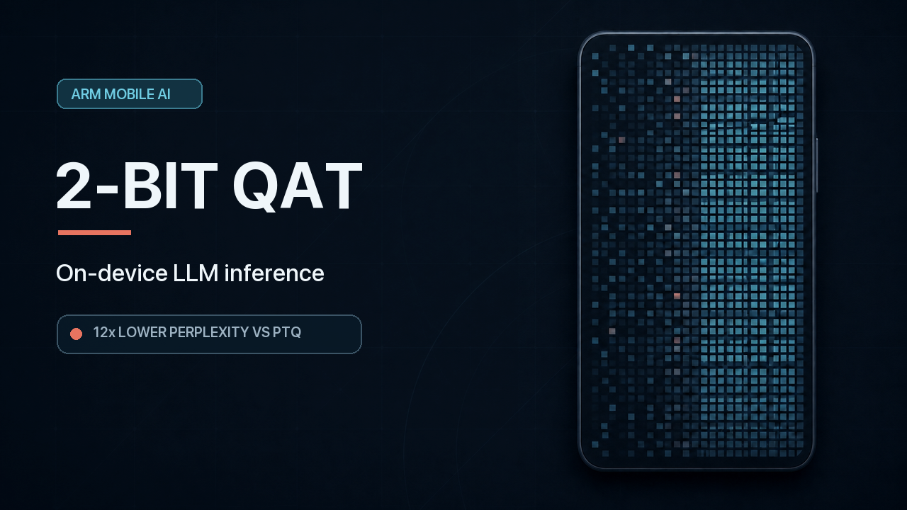
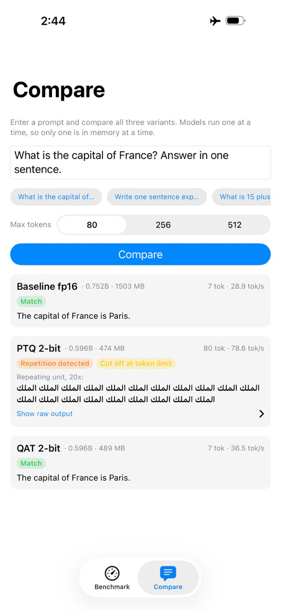
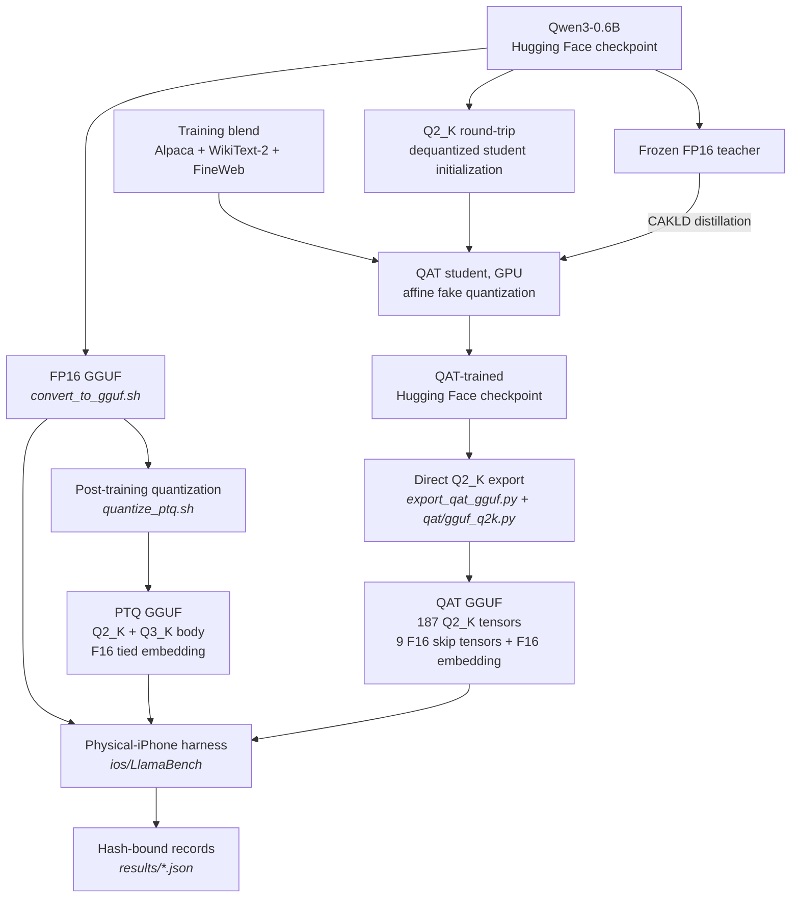

# 2-bit QAT for on-device LLM inference on Arm

> Quantization-aware training (QAT) takes Qwen3-0.6B to 2 bits and delivers **12× lower perplexity than post-training quantization (PTQ) at a closely matched footprint**, measured on an iPhone 17 Pro Max.


## Project overview

Running a language model on a phone requires substantial compression. In this
experiment, naive 2-bit PTQ raises WikiText-2 perplexity from 21.4 to 220.9. QAT
is intended to recover that lost quality by allowing the model to adapt to
quantization during training instead of applying it only after training.

This project evaluates that approach end to end on the hardware that runs the
model. It builds on the
[Apple Intelligence Foundation Language Models: Tech Report 2025](https://arxiv.org/abs/2507.13575)
and related work listed in [References](#references). The comparison uses one
base model and one on-device runtime, with the remaining precision-layout
differences disclosed below.

Built for the Arm Create: AI Optimization Challenge, Track 3: Mobile AI.

The final QAT-derived Q2_K GGUF is published on Hugging Face at
[**AMR5210/qwen3-0.6b-qat-q2k**](https://huggingface.co/AMR5210/qwen3-0.6b-qat-q2k),
so judges can validate the deployed model without repeating the training run.
See [Quick start](#quick-start) for the download.

## Demo video

<p align="center">
  <a href="https://youtu.be/3NZp0hgWAfo">
    
  </a>
</p>

Watch the FP16, PTQ, and QAT variants run on an iPhone 17 Pro Max, including
the same-prompt comparison and measured results.

## Contents

- [Demo video](#demo-video)
- [Results on iPhone 17 Pro Max](#results-on-iphone-17-pro-max)
- [Why this matters](#why-this-matters)
- [What is being compared](#what-is-being-compared)
- [Quick start](#quick-start)
- [Project architecture and QAT design](#project-architecture-and-qat-design)
- [Repository structure](#repository-structure)
- [Reproduction paths](#reproduction-paths)
- [Key experimental and implementation decisions](#key-experimental-and-implementation-decisions)
- [Benchmark methodology and validation](#benchmark-methodology-and-validation)
- [Experiments that did not improve results](#experiments-that-did-not-improve-results)
- [Limitations](#limitations)

## Results on iPhone 17 Pro Max

| Variant | File size (MB) ↓ | Peak app RAM (MB) ↓ | Prompt processing (tok/s) ↑ | Generation (tok/s) ↑ | WikiText-2 perplexity ↓ |
|---|---:|---:|---:|---:|---:|
| FP16 baseline | 1509.3 | 4220.6 | **819.23** | 47.34 | 21.37 |
| PTQ 2-bit | **479.8** | **2149.3** | 686.39 | 64.27 | 220.91 |
| **QAT 2-bit** | 495.2 | 2181.0 | 758.27 | **67.30** | **18.46** |

iPhone 17 Pro Max (A19 Pro), CPU backend, four threads. Full records with model
hashes are available in [`results/`](results/). Rebuild this table from the
checked-in records with
`python scripts/summarize_results.py`.

### How to interpret these results

**FP16 footprint caveat:** the reported 1509.3 MB FP16 artifact includes a
311.2 MB byte-identical duplicate `output.weight` tensor. The two quantized
artifacts use tied embeddings and do not carry that duplicate. It contributes to
both the reported disk and peak RAM figures, so the FP16-to-2-bit footprint ratios
compare the measured artifacts rather than tied-embedding-normalized structures.

The on-device perplexity figures reproduce llama.cpp's own `llama-perplexity` to
within **0.011%** on all three variants, validating the on-device implementation
against the desktop reference.

### Same-prompt output comparison

<p align="center">
  
</p>

<p align="center"><em>For the same prompt, FP16 and QAT return the matching answer while PTQ enters a repetitive output loop.</em></p>

## Why this matters

Private, offline AI on memory-constrained devices depends on quantization
preserving usable behavior, not merely shrinking a model file. Here, naive 2-bit
PTQ has a low footprint yet reaches 220.91 WikiText-2 perplexity and enters a
repetitive output loop for the same prompt, making it unusable in practice. The
reproducible on-device QAT result shows that training the model to adapt to
quantization, not just quantizing it after the fact, is what makes a 2-bit
deployment viable.

## What is being compared

Two claims, measured separately (full definitions in
[`docs/METHODOLOGY.md`](docs/METHODOLOGY.md)):

- **Claim A — QAT 2-bit vs FP16.** A size and speed win in the measured artifacts:
  3.05× smaller on disk, 1.94× less RAM, and 1.42× faster generation. The disk
  and RAM ratios are not normalized for tied embeddings: the FP16 artifact
  contains a 311.2 MB duplicate `output.weight` tensor that neither 2-bit artifact
  carries. PTQ delivers similar footprint and speed gains, so this claim does not
  establish an effect from QAT specifically.
- **Claim B — 2-bit QAT vs 2-bit PTQ.** A quality comparison at the same nominal
  bit width and a closely matched total footprint, rather than a tensor-for-tensor
  identical comparison.

Claim B is easy to get wrong. A 2-bit variant that quietly keeps
more tensors at higher precision wins on quality without QAT contributing
anything. Both artifacts contain 310 tensors and 0.5960 billion elements, use
identical tensor names, and share F16 tied embeddings, but their transformer-body
precision layouts diverge in both directions. PTQ holds 83 tensors at `Q3_K`
rather than `Q2_K`, while QAT holds nine skip-layer tensors at F16. Excluding the
shared 311.2 MB embedding, the PTQ body is 168.6 MB and the QAT body is 184.0 MB,
a 9.1% difference. Across the complete artifacts, QAT is 3.2% larger on disk and
uses 1.5% more peak app RAM. Claim B is therefore closely footprint-matched, not
a training-only ablation. The exact tensor inventories and this known divergence
are recorded in [`scripts/model_signatures.json`](scripts/model_signatures.json).

In separate desktop llama.cpp `llama-perplexity` evaluations on the off-domain
C4 dataset, which contributes nothing to the training blend, QAT measures 32.25
perplexity against PTQ's 279.30. These are desktop results, not measurements from
the physical iPhone. The resulting 8.7× gap is smaller than the 12.0× measured on
WikiText-2, suggesting that part of the WikiText-2 margin comes from domain
alignment. The full off-domain results are in
[`results/c4_perplexity.json`](results/c4_perplexity.json).

## Quick start

### Validate the QAT model in one command

```bash
./scripts/judge_demo.sh
```

To try a different prompt, pass it as a quoted argument; omitting it runs the
fixed validation prompt shown by the script:

```bash
./scripts/judge_demo.sh "Explain why on-device AI can improve privacy."
```

Custom responses are limited to 64 generated tokens and may end sooner if the
model completes its answer.

On a clean checkout, this path requires Bash, Git, CMake, a C/C++ toolchain,
`curl`, and either `shasum` or `sha256sum`, plus internet access to fetch
llama.cpp and the model.

[`scripts/judge_demo.sh`](scripts/judge_demo.sh) builds the pinned llama.cpp if it
is not already built, downloads the QAT model only, verifies its SHA-256 against the
published digest, and answers one prompt — printing the answer, this host's
throughput, and the verified digest. It hard-fails if the digest does not match.
Re-runs skip the build and the download; a warm run finishes in a few seconds.

This uses the **desktop** llama.cpp build and runs on any Arm64 or x86_64 host. It
needs no iPhone, no Xcode, and no code signing. The on-device figures in the results
table above come from the separate harness in [`ios/`](ios/README.md), which does
require all three, and the throughput the script prints is this host's — not the
recorded iPhone number.

### Full reproduction setup

Desktop setup requires Bash, Python 3.10+, Git, `cmake`, and a C toolchain. QAT
training additionally requires a GPU and several hours. The on-device workflow
requires a Mac with Xcode, code signing, and an iPhone; see the
[`ios/` guide](ios/README.md).

#### Build the FP16 and PTQ baselines

`scripts/build_llama_cpp.sh` checks out llama.cpp build `b10210` at commit
`000547513f1530346ecd163db8b3e13962949961`, the revision used for the final
recorded remeasurements.

```bash
./scripts/setup_env.sh                 # venv + dependencies
source .venv/bin/activate
./scripts/build_llama_cpp.sh           # builds the pinned llama.cpp revision
python scripts/download_model.py       # base model -> models/qwen3-0.6b-hf
./scripts/convert_to_gguf.sh           # -> models/qwen3-0.6b-fp16.gguf
./scripts/quantize_ptq.sh              # -> models/qwen3-0.6b-ptq-q2_k.gguf
python scripts/prepare_eval_data.py    # WikiText-2 + C4 eval corpora
```

#### Download the verified QAT deployment model

The final QAT-derived GGUF is published, so model validation and comparison do
not require retraining. The download needs no Hugging Face account, token, or
CLI:

```bash
mkdir -p models
curl -L -o models/qwen3-0.6b-qat-q2_k.gguf \
  https://huggingface.co/AMR5210/qwen3-0.6b-qat-q2k/resolve/main/fineweb-blend/qwen3-0.6b-qat-fineweb-blend-q2_k.gguf
```

The `-o` path renames the file as it is written. This is deliberate, not a
workaround: the published name identifies which recipe produced the file, while
every script here and the iOS app read one fixed path,
`models/qwen3-0.6b-qat-q2_k.gguf`, whichever variant is current.

#### Verify model identities

Verify what landed on disk before using it. A filename is not an identity — a
failed `curl -L` writes an HTML or JSON error body under the same `.gguf` name, and
an earlier round of measurements in this project was invalidated by a same-named
export:

```bash
shasum -a 256 models/qwen3-0.6b-qat-q2_k.gguf
# expected: a861b8924a2b1881720d38123ec32aae7f99ac05732d819644a6584f3cc38fef

python scripts/verify_model_signatures.py    # confirms all three files by SHA-256
```

#### Compare generated outputs

Generate outputs for the same prompt across all three variants:

```bash
./scripts/compare_generations.sh
```

The generated comparisons are written to `results/generation_compare/`.

## Project architecture and QAT design

### End-to-end evaluation pipeline



Both 2-bit branches produce GGUF artifacts with closely matched total footprints,
but their tensor-type mixes remain different as detailed in Claim B above.

### QAT configuration used in this project

Weights are fake-quantized per group with an affine min/max scheme and a
straight-through estimator, using the full asymmetric integer range — at 2 bits,
where there are four codes in total, spending one on a symmetric zero point is
expensive. Training starts from a Q2_K-rounded checkpoint rather than FP16 and
distills against the FP16 teacher with BitDistiller's confidence-aware KL
(CAKLD) objective. Nine outlier-heavy layers are held at full precision.

### Why direct Q2_K export is required

A common way to export a QAT checkpoint to GGUF is to write FP16 weights and then
run `llama-quantize`. In this workflow, that would discard the learned
quantization parameters: `llama-quantize` **derives a new set of Q2_K parameters**
from the FP16 weights, so the model running on the device would not be the
quantized model optimized during training.

[`qat/gguf_q2k.py`](qat/gguf_q2k.py) is a pure-NumPy Q2_K encoder that removes the
round trip — a port of ggml's reference quantizer (`quantize_row_q2_K_ref` /
`make_qkx2_quants`), including Q2_K's two-level structure: 256-element super-blocks
split into 16 sub-blocks, whose scales and minima are themselves 4-bit-quantized
under an FP16 super-block scale. Training uses `--group-size 16` so the QAT groups
line up with those sub-blocks and trained values land on the deployment grid.

Correctness can be checked without a C toolchain: packed blocks are decoded again
with gguf-py's trusted `Q2_K.dequantize_blocks`. This round-trip check detects
byte-layout errors independently of quantization quality.

## Repository structure

| Path | Contents |
|---|---|
| `qat/` | QAT implementation: fake quantization, Q2_K encoder, distillation losses |
| `scripts/` | Pipeline: setup, convert, quantize, train, evaluate, benchmark |
| `ios/` | iOS benchmark harness and Compare app ([README](ios/README.md)) |
| `results/` | Per-variant records, perplexity analyses, generated summary |
| `docs/` | Methodology, generation-quality findings, training-environment setup |
| `eval/data/` | Generated evaluation corpora (not committed) |

## Reproduction paths

### Desktop benchmark

Run the desktop benchmark for a model with:

```bash
python scripts/benchmark.py --tag ptq-2bit --device "<host>" \
  --model models/qwen3-0.6b-ptq-q2_k.gguf
```

The desktop harness records model identity, perplexity, throughput, memory, and
the host description in a per-variant JSON file under [`results/`](results/).

### Physical-iPhone benchmark

See [`ios/README.md`](ios/README.md) for the physical-device harness, framework
build, model staging, signing, and benchmark procedure used for the results table.

### Optional QAT retraining

To train rather than download the published QAT deployment model, follow
[`docs/AMD_ROCM_SETUP.md`](docs/AMD_ROCM_SETUP.md) or
[`docs/COLAB_SETUP.md`](docs/COLAB_SETUP.md), then run
`python scripts/train_qat.py --help` for the available training options.

## Key experimental and implementation decisions

| Decision | Alternative considered | Rationale |
|---|---|---|
| Custom Q2_K encoder (`qat/gguf_q2k.py`) | Writing FP16 and letting `llama-quantize` pack it | `llama-quantize` derives new Q2_K parameters, so the deployed weights would not be the quantized weights optimized during training |
| QAT group size 16 | The more common 32 | Q2_K's sub-blocks are 16 elements; matching them puts trained values on the deployment grid instead of requiring re-quantization at export |
| Affine asymmetric fake-quantization | ParetoQ's symmetric stretched elastic quantization (SEQ) | The reported perplexity confidence intervals overlap ([26.378, 26.810] vs [26.686, 27.124]), making the result a tie; affine is simpler and avoids SEQ's initialization sensitivity |
| CAKLD distillation objective | Sliced-Wasserstein hidden-state alignment | CAKLD 26.95 vs Wasserstein 27.40 at matched loss share, with quality degrading monotonically as Wasserstein weight rose |
| F16 tied embeddings in the PTQ baseline | `llama-quantize`'s default Q2_K embedding plus untied duplicate | Matches the QAT export, so no embedding-precision advantage is credited to QAT training; also improved PTQ from 275.89 to 220.93 |
| FineWeb blend at 0.5, WikiText-2 at 0.05 | WikiText-heavy blend at 0.5 | 26.95 → 18.49, and the off-domain C4 gain was larger (−42.4%) than the in-domain one (−31.4%), indicating generalization rather than domain alignment |
| CPU backend (`n_gpu_layers = 0`) | llama.cpp's Metal default on iOS | Metal bypasses the CPU backend entirely, so an Arm-CPU figure has to come from the CPU path |

## Benchmark methodology and validation

The benchmark results depend on the harness measuring each workload consistently:

- **Perplexity replicates `llama-perplexity` rather than approximating it** —
  non-overlapping 512-token chunks, KV cache cleared per chunk, scoring positions
  `[256, 511)`. On-device results land within 0.011% of the desktop reference on
  every variant.
- **KV clearing is verified, not assumed.** `llama_memory_seq_pos_max` is read
  before and after each throughput repetition: `-1` after every clear and `511`
  after every 512-token pass. Cache reuse would have inflated later repetitions.
- **Model identity is checked before measurement.**
  `scripts/verify_model_signatures.py` validates size, tensor mix, skip-layer set
  and SHA-256 against [`scripts/model_signatures.json`](scripts/model_signatures.json).
  Every record embeds the hash of the file it measured.
- **Throughput is the mean of five repetitions**, matching `llama-bench`.
  Per-repetition samples decline 15–19% across a run. The short interval suggests
  boost-clock settling rather than thermal throttling; all five samples remain in
  the reported mean, making it conservative relative to the first-repetition peak.

Details in [`docs/METHODOLOGY.md`](docs/METHODOLOGY.md) and
[`docs/GENERATION_QUALITY.md`](docs/GENERATION_QUALITY.md).

## Experiments that did not improve results

Negative results are recorded with the same detail as positive ones, in
[`results/wikitext2_perplexity.json`](results/wikitext2_perplexity.json) under
`analysis`.

| Experiment | Finding | Decision |
|---|---|---|
| PTQ baseline with Q2_K embeddings | Gave QAT an advantage it had not earned — embeddings were never trained under fake-quant | Rebuilt PTQ with F16 tied embeddings. Made **PTQ 20% better** (275.89 → 220.93); the QAT result now stands against a stronger baseline |
| Sliced-Wasserstein distillation | Lost to CAKLD at matched loss share, 27.40 vs 26.95 | Closed. The first run was also confounded: `--distill-weight` is not comparable across loss types, and 0.5 gave Wasserstein 69–74% of total loss against CAKLD's 10–20% |
| ParetoQ SEQ quantizer | Confidence intervals overlap — a tie, not a win | Reported as a tie. The real finding was init sensitivity: a 1.49× swing from init mode alone |
| Progressive 4→2 bit annealing | No measurable effect | Confirmed with a dedicated control run, then disabled |
| Instruction-following accuracy | Every variant at or below the 25% chance line under three scoring methods | Dropped from reported metrics. Forced-choice scoring showed why: `qat-2bit` picks "A" for all 100 questions, exactly the 18% constant-A rate |
| KleidiAI on the 2-bit path | `supports_op` covers Q4_0/Q8_0/F32, not Q2_K | Stated plainly: zero acceleration on the path the headline result uses |

A stale QAT export also went undetected long enough to produce misleading
measurements. It had the same filename and a plausible size, but contained three
extra skip-layers and matched no recorded run. As a result,
`verify_model_signatures.py` checks every model against `model_signatures.json`,
and every result record embeds its model's hash.

## Limitations

- **No FP16 ceiling run.** Ratios against unadapted FP16 conflate domain
  adaptation with the cost of quantization. QAT's 18.46 beating FP16's 21.37 on
  WikiText-2 is *not* evidence that 2-bit beats FP16 — FP16 never saw the training
  blend. A fair ceiling was not run.
- **The FP16 footprint is not tied-embedding-normalized.** Its 1509.3 MB file
  contains a 311.2 MB byte-identical `output.weight` duplicate that the tied PTQ
  and QAT artifacts omit, inflating both its disk and peak RAM measurements. The
  reported 3.05× disk and 1.94× RAM reductions for QAT therefore compare the
  measured artifacts, not otherwise identical tensor structures.
- **Footprint parity is close, not exact**: 3.2% disk, 1.5% RAM.
- **QAT does not fully match FP16 generation behavior.** It preserves
  substantially better quality than PTQ, but on some prompts it answers correctly
  and then repeats or fails to terminate cleanly. Detailed findings and follow-up
  work are recorded in [`docs/GENERATION_QUALITY.md`](docs/GENERATION_QUALITY.md).
- **KleidiAI contributes nothing to the 2-bit path.** Its microkernels target
  int4/int8; `Q2_K` matmuls run on stock ggml CPU kernels.
- **One base model, one device.** Qwen3-0.6B on A19 Pro. An iPhone 12
  cross-generation run needs a second framework build at `armv8.2-a`, since the
  default baseline raises SIGILL on A14.
- **No distributable iOS build.** The app requires code signing and about 2.5 GB
  of model files. Judges can use the demo video, screenshot, result records, and
  desktop validation path without installing the app.
- **The training blend includes Alpaca, which is CC BY-NC 4.0 — non-commercial.**
  Whether that restriction reaches model weights trained on the data is unsettled.
  Stanford's own Alpaca release took the position that it does: their notice states
  the dataset allows only non-commercial use, and that models trained on it should
  not be used outside research purposes. One part of their reasoning does not carry
  over — their base model was LLaMA, whose license was itself non-commercial, while
  this project's base is Qwen3-0.6B under Apache-2.0. The data question remains open
  regardless, and the published GGUF's Apache-2.0 label, inherited from Qwen3-0.6B,
  does not resolve it. Anyone considering commercial use should evaluate this
  independently or consult counsel. Full license inventory in
  [THIRD_PARTY_NOTICES.md](THIRD_PARTY_NOTICES.md).

## References

- Apple, [*Apple Intelligence Foundation Language Models: Tech Report 2025*](https://arxiv.org/abs/2507.13575) (2025).
- Liu et al., [*LLM-QAT: Data-Free Quantization Aware Training for Large Language Models*](https://arxiv.org/abs/2305.17888) (2023).
- Chen et al., [*EfficientQAT: Efficient Quantization-Aware Training for Large Language Models*](https://arxiv.org/abs/2407.11062) (2024).
- Du et al., [*BitDistiller: Unleashing the Potential of Sub-4-Bit LLMs via Self-Distillation*](https://arxiv.org/abs/2402.10631) (2024).
- Liu et al., [*ParetoQ: Scaling Laws in Extremely Low-bit LLM Quantization*](https://arxiv.org/abs/2502.02631) (2025).

## License

The **code** in this repository is MIT — see [LICENSE](LICENSE).

The **published model artifact** is Apache-2.0, inherited from Qwen3-0.6B. These are
different licenses covering different things: the MIT grant does not extend to the
weights.

[THIRD_PARTY_NOTICES.md](THIRD_PARTY_NOTICES.md) lists every external model, dataset,
and library with its verified license, and flags one constraint worth knowing before
any commercial use — the training blend includes Alpaca, which is CC BY-NC 4.0.
